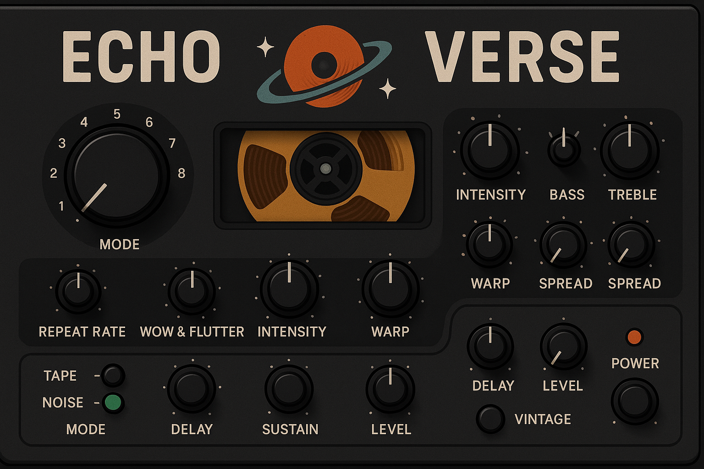

# EchoVerse 🎛🪐  
_Analog soul. Digital space._  

**EchoVerse** is a retro-futuristic delay & reverb plugin for Ableton Live, inspired by the legendary Roland Space Echo. Recreated as a Max for Live device, EchoVerse fuses the lo-fi charm of tape echo with modern stereo processing and time-warping capabilities.




---

## ✨ Features

- 🎚 **Multi-head Tape Delay** — switchable playback heads with tempo sync
- 🌪 **Wow & Flutter** — modulate the pitch for vintage character
- 🔥 **Tape Saturation** — warm distortion with variable hiss and wear
- 🌀 **Spring Reverb** — deep & splashy reverb with tonal shaping
- 🧬 **Time Warp** — dynamically stretch/bend delay time
- 🌌 **Stereo Spread & Drift** — width, wobble, and retro stereo panning
- ⚙️ **Feedback Loop Filters** — shape the tail with hi/lo-pass EQ
- 🖥 **Resizable Interface** — animated reels, vintage meter graphics
- 🧑‍🚀 **Vintage/Modern Mode** — toggle between RE-201 warmth and hi-fi clarity

---

## 🔧 Requirements

- **Ableton Live 11 or later**
- **Max for Live** installed
- macOS or Windows

---

## 📦 Installation

1. Download or clone this repo:
   ```bash
   git clone https://github.com/frangedev/EchoVerse.git
   ```

2. Drag `EchoVerse.amxd` into your Ableton Live session on an audio track.

3. Tweak the knobs and ride the delay into the cosmos 🌌

---

## 🎛 Controls Overview

| Section | Control | Description |
|--------|---------|-------------|
| Delay Heads | H1, H2, H3 | Activates individual tape heads |
| Delay Time | Sync / Free | BPM-sync or millisecond-based delay |
| Saturation | Drive, Noise | Controls for analog distortion & hiss |
| Modulation | Wow, Flutter | Adds pitch instability |
| Reverb | Spring Amount, Tone | Classic spring reverb simulation |
| Feedback | Amount, Filter | Delay feedback control and EQ |
| Stereo | Spread, Drift | Stereo width and analog wobble |
| Time Warp | Warp Depth | Real-time delay shifting |

---

## 🧪 Roadmap

- [ ] Preset browser
- [ ] MIDI-mapped delay freeze
- [ ] CV input support (via CV Tools)
- [ ] VST/AU standalone port (future)

---

## 👨‍🚀 About

EchoVerse is an open-source sound design tool developed by [FRANGE](https://github.com/frangedev), blending analog nostalgia with digital power.

---

## 🛠 License

MIT License  
Feel free to fork, remix, and expand.

---

## 🤖 Contributing

Pull requests and feature suggestions welcome!  
Create an issue or open a discussion to chat ideas 🚀
